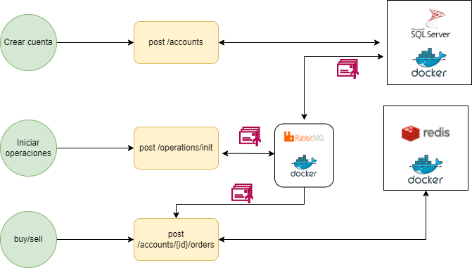

# Challenge GBM

#### Instalar y ejecutar los contenedores docker ubicados en los archivos en Installers/:

**_DockerInstallerRabbitMQ.bash_** , **_DockerInstallerRedis.bash_** y **_DockerInstallerSQLSERVER.bash_**

### Script de creacion de tablas SQLserver

* Ejecutar los scripts de la Carpeta Installers/Scripts de acuerdo al orden del prefijo.

#### Diagrama de arquitectura de la solución.
**_Challenge.drawio.png_**


#### Flujo de negocio

1.  Se debera crear la cuenta consumiendo el siguiente recurso:

> POST /gbm/challenge/v1/accounts
```
	Request body
	{
	"cash": 1000,
	"email": "gbm@challenge.com",
	"countryKey": "MX"
	}
	 
	 Response

	{
	  "id": 4,
	  "cash": 1000,
	  "email": "gbm@challenge.com",
	  "countryKey": "MX",
	  "createdAt": "2022-05-04T19:36:55.39",
	  "issuers": []
	}
```

2.  Se debera indicar a la mini red de microservicios que se inician operaciones, se realiza consumiendo el siguiente servicio:

> POST /gbm/challenge/v1/accounts/prepare
```
	{
	  "invesmentId": 4,
	  "ownerEmail": "gbm@challenge.com"
	}
```
3.  Despues de iniciar operaciones, iniciar transacciones BUY/SELL


> POST /gbm/challenge/v1/accounts/{id}/orders
``` 
 Path
  id = 4

	Request body BUY

{
  "operation": "BUY",
  "issuer_Name": "AAPL",
  "total_Shares": 5,
  "share__Price": 100
}

	Response BUY
{
  "data": {
	"cash": 500,
	"issuers": [
	  {
		"issuer_name": "AAPL",
		"total_shares": 5,
		"share_price": 100,
		"set_id": "7d5310d6-0bcb-4285-af29-f653ee799e67"  // importante, Representa el Id de la compra
	  }
	]
  },
  "reqId": "80000016-0000-fc00-b63f-84710c7967bb",
  "code": 201
}
```

```
 Request body SELL

{
  "operation": "SELL",
  "issuer_Name": "APPL",
  "total_Shares": 1,
  "share__Price": 100,
  "set_Id": "7d5310d6-0bcb-4285-af29-f653ee799e67"
}


Response SELL

{
  "data": {
    "cash": 600,
    "issuers": [
      {
        "issuer_name": "AAPL",
        "total_shares": 4,
        "share_price": 100,
        "set_id": "7d5310d6-0bcb-4285-af29-f653ee799e67"
      }
    ]
  },
  "reqId": "80000041-0004-fd00-b63f-84710c7967bb",
  "code": 201
}
```
#### Descripcion de soluciones.

1. **_GBM.Challenge.API.CreateInvesment_** : 
 Se encarga de crear la cuenta de inversion.
2. **_GBM.Challenge.API.OpenTransactios_** : 
 Se encarga de iniciar operaciones.
3. **_GBM.Challenge.API.Transactions_** : 
 Se encarga de las transacciones BUY/SELL.

#### Tecnologías.

1. Redis
> Gracias a su velocidad y facilidad de uso, la seleccione ya que necesitamos procesar cientos de miles de transacciones por segundo.
2. SQLserver
> Guarda los datos de la cuenta de inversion.
3. RabbitMQ
> Bus de mensajes para lograr la comunicación entre la mini red de microservicios.
4. Docker
> Me permitio instalar varias tecnologías de manera local.
5. NetCore
> Desarrollos de los microservicios

